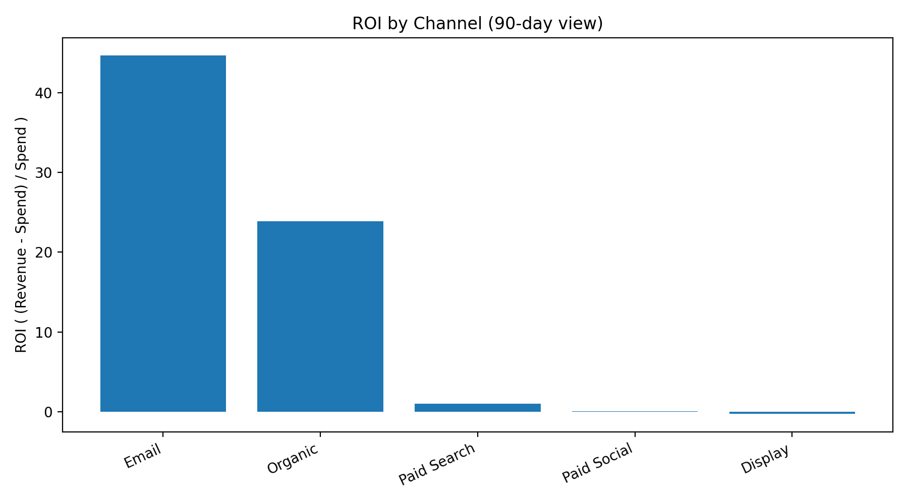

# Marketing Performance & ROI Analysis

## How to navigate this repository
- The README provides the business context, approach, insights, and recommendations
- The analysis folder contains the supporting notebooks or scripts
- The visuals folder includes stakeholder-facing snapshots used to support decisions

## Overview
This project evaluates marketing performance across multiple channels to support ROI-driven budget and campaign decisions. The project demonstrates marketing analytics and ROI analysis skills to support campaign performance evaluation and budget optimisation.

The focus is on identifying which activities contribute most effectively to business outcomes rather than surface-level engagement metrics.

## Starter project narrative

### Context
A business is investing across multiple digital marketing channels, but leadership lacks clarity on which activities are driving meaningful commercial outcomes. Reporting focuses heavily on engagement metrics, making it difficult to justify spend or confidently reallocate budget.

### Decision
Marketing leadership needs to decide how to optimise budget allocation across channels and campaigns in order to improve return on investment while maintaining performance.

### Outcome
This analysis provides a clear, ROI-focused view of marketing performance, highlighting which channels and campaigns contribute most effectively to business outcomes. The insights support data-informed budget reallocation and a shift towards commercially relevant performance measurement.

## Business context
Marketing teams often face pressure to justify spend while managing multiple channels and campaigns.

This project reflects a scenario where leadership wants to:
- Understand ROI by channel
- Identify inefficient spend
- Improve future budget allocation

## Key business question
Which marketing channels and campaigns deliver meaningful business value, and how should budget be reallocated to improve overall performance?

## Data & assumptions
The analysis uses campaign-level data including:
- Spend
- Conversions or leads
- Revenue or revenue proxies

Attribution assumptions are clearly stated to keep the analysis transparent and realistic.

## Analytical approach
- Aggregate performance by channel and campaign
- Compare spend against revenue contribution
- Evaluate efficiency using ROI and cost-based metrics

The emphasis is on **decision relevance**, not metric overload.

## Insight snapshot

*Snapshot showing ROI by channel to support budget allocation and campaign optimisation decisions.*

## Executive summary artefact
Executive-level decision briefs translating analysis into stakeholder-ready outputs.
- [View executive summary (PDF)](executive-summary/marketing_performance_roi_executive_summary.pdf.pdf)
  
## Key insights
- Higher spend does not necessarily lead to better performance
- Some lower-cost channels deliver stronger ROI
- Performance varies significantly across campaigns within the same channel

## Recommended actions
- Reallocate budget towards consistently high-ROI channels
- Review or pause underperforming campaigns
- Shift reporting focus from vanity metrics to commercial outcomes
- 
## Skills demonstrated
- Business analysis and decision framing
- Data analysis using Python and SQL
- Commercial performance evaluation
- Stakeholder-focused insight communication

## Tools used
- SQL and Python for analysis
- Data visualisation for insight communication
- Business-focused KPI selection

## Limitations & next steps
Future enhancements could include:
- Time-based trend analysis
- Multi-touch attribution modelling
- Integration with customer lifetime value
